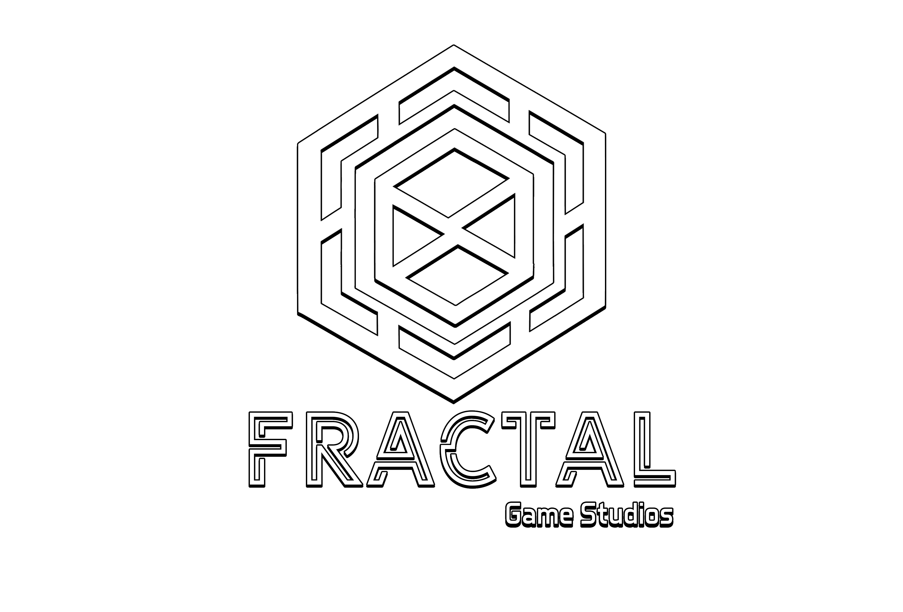

### 
OXY3N was born from the union of two very enthusiastic modders with the desire to create new content for FiveM.

We are programmers and graphic designers with extensive experience and we are just starting in this wonderful community.

 

## Our Skills
<table><tr><td valign="top" width="33%">

### Design  

  
  
  
  
  
  
  

</td><td valign="top" width="33%">

### Frontend  

  
  
  
  
  
  
  
  
  
  
  
  

</td><td valign="top" width="33%">

### Backend  

  
  
  
  
  
  
  
  
  
  
  
  
  
  
  
  
  
  
  

</td></tr></table>  

   
 

<table>
    <tr>
        <td align="center">
            
            

            
        </td>
        <td align="center">
            
            

            
        </td>
    </tr>
    <tr>
        <td align="center">
            
            

            
        </td>
    </tr>
</table>
 
 

    
    

## FiveM - Resources Metrics

<!-- STATS START -->
## Server Stats (Updated: 2025-05-15 12:05 UTC)

| Resource | Servers | Change | Direction |
|---|---|---|---|
| oxy3n_fastfood | 129 | +51 | up |
| oxy3n_dessert | 65 | -253 | down |
| oxy3n_liquorpack | 26 | -618 | down |
| oxy3n_meleepack1 | 20 | +156 | up |
| oxy3n_meleepack2 | 13 | +75 | up |
| oxy3n_liquorpack_NOCOPY | 13 | -4109 | down |
| oxy3n_sushipack | 12 | +3693 | up |
| oxy3n_scythe | 11 | -67 | down |
| oxy3n_freshfood_2 | 4 | +549 | up |
| oxy3n_recyclers | 4 | -356 | down |
| oxy3n_preparedfood | 4 | +701 | up |
| oxy3n_drinks | 4 | +449 | up |
| oxy3n_canfood | 4 | -295 | down |
| oxy3n_nailspack | 2 | +44133 | up |
| oxy3n_recyclers_model | 2 | -5041 | down |
| venty_assets_dessert_props-oxy3n | 2 | -56743 | down |
| venty_assets_fastfood_props-oxy3n | 2 | -56743 | down |
| venty_assets_liquorpack_props-oxy3n | 2 | -56743 | down |
| oxy3n_freshfood | 2 | +11012 | up |
| oxy3n_zombies_runners | 1 | -6430 | down |
| oxy3n_foodprops | 1 | +16851 | up |
| oxy3n_meleepack | 1 | +16851 | up |
| oxy3n_scythe-main | 1 | +16851 | up |
| fractal_canfood | 18 | +161 | up |
| fractal_meleeweapon_v1 | 13 | -184 | down |
| fractal_meleeweapon_v3 | 10 | -132 | down |
| fractal_meleeweapon_v2 | 9 | -944 | down |
| fractal_canfood-main | 2 | -26579 | down |
| fractal_mod_crystal | 1 | -19707 | down |
| fractal_anims | 1 | +27525 | up |
| fractal_bodyremastered | 1 | +27525 | up |
| fractal_burial | 1 | +27525 | up |
| fractal_crafting | 1 | +27525 | up |
| fractal_crafting_models | 1 | +27525 | up |
| fractal_dessert | 1 | +27525 | up |
| fractal_importexport | 1 | +27525 | up |
| fractal_itemcreator | 1 | +27525 | up |
| fractal_nos | 1 | +27525 | up |
| fractal_pelos | 1 | +27525 | up |
| fractal_proputil | 1 | +27525 | up |
<!-- STATS END -->

